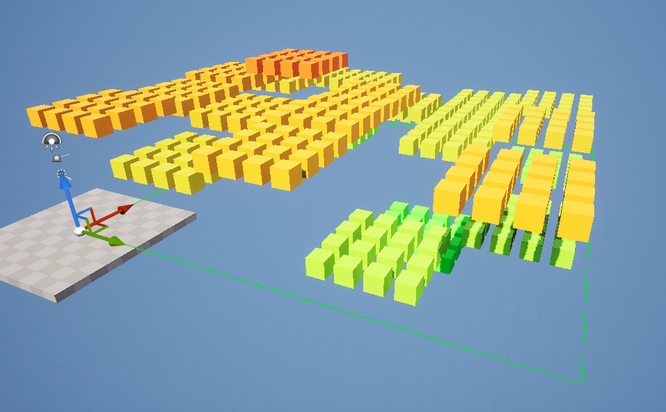
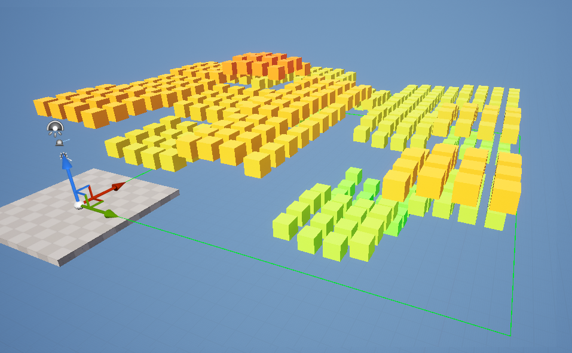
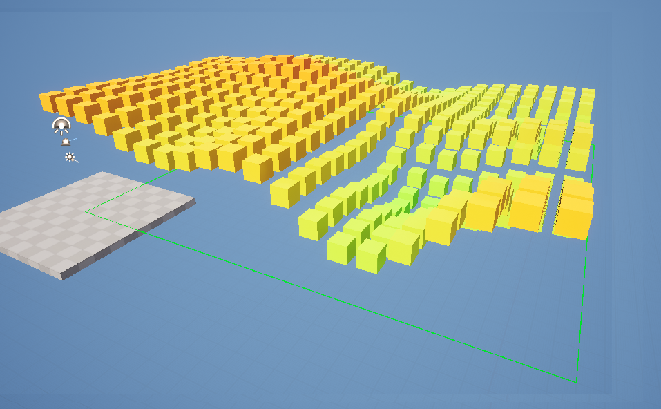
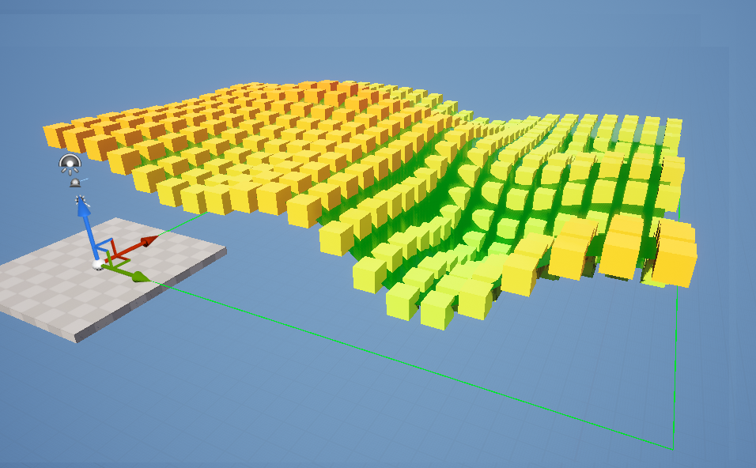
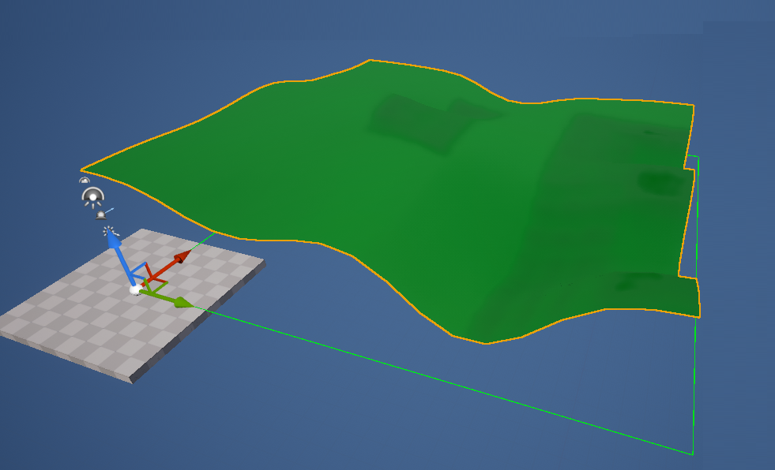

# Dynamic Procedural 3D Terrain Generation
### This project showcases how one might implement dynamic procedural terrain generation for 3D games on UE5.

#### The algorithm is quite straight forward, step 1 is to create chunks of vertices at different heights.
#### Here, the red color will represent higher chunks :

#### Step 2 is to smooth chunks with eachother :

#### Here you can see the fully smoothed chunks :

#### Step 3 is to generate an according static mesh :

#### And here's the final result :

